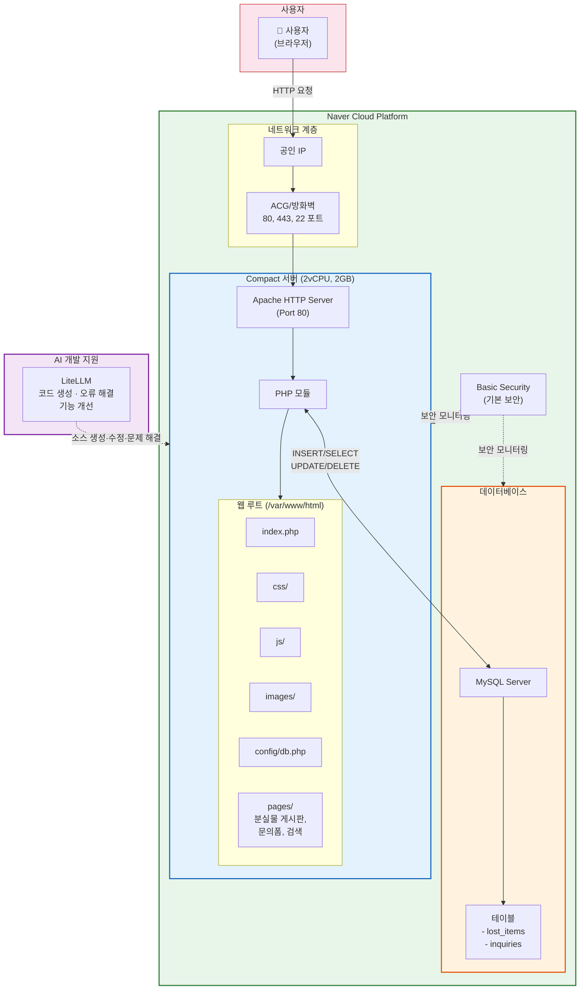
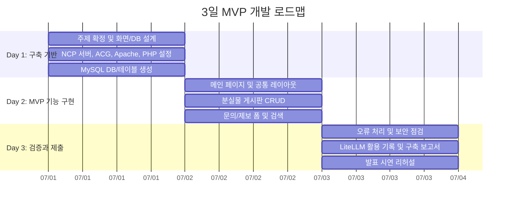
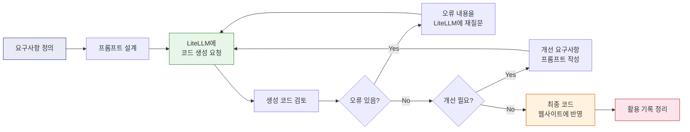

# 가천대학교 AI활용 웹사이트 구축 프로젝트 — 기획 문서

> **문서 버전:** v1.1
> **작성일:** 2026-06-30
> **프로젝트 기간:** 3일
> **참고 자료:**
> - `가천대학교-AI활용_프로젝트.md` — 프로젝트 평가 기준 (100점, 4개 영역, 23개 항목)
> - `NAVER CLOUD PLATFORM 네이버 클라우드 플랫폼.pdf` — 소규모 웹사이트 레퍼런스 아키텍처

---

## 0. 주제

### 0.1 주제 선정 기준

프로젝트 기간이 **3일**이므로, 주제는 짧은 기간 안에 Apache + MySQL + PHP로 구현하고 시연할 수 있어야 한다. 따라서 회원가입, 결제, 실시간 알림, 복잡한 권한 관리처럼 구현 시간이 큰 기능은 제외하고, **게시글 작성·조회·수정·삭제(CRUD), 문의/신청 폼, 검색, 오류 처리**가 자연스럽게 들어가는 주제를 우선한다.

### 0.2 주제 후보

| 후보 | 주제 | 3일 MVP로 적합한 이유 | 핵심 기능 |
|---:|---|---|---|
| 1 | **가천대 캠퍼스 분실물 찾기 게시판** | 게시글 CRUD, 물품명/장소/연락처 입력, 검색 기능을 단순하게 구현 가능 | 분실물 등록, 목록·상세 조회, 수정·삭제, 키워드 검색, 문의 |
| 2 | **동아리·스터디 모집 게시판** | 모집글과 신청폼만으로 사용자 기능과 DB 연동을 명확히 보여줄 수 있음 | 모집글 등록, 신청폼, 모집 상태 변경, 검색 |
| 3 | **학과 행사 신청 안내 사이트** | 행사 안내, 신청자 저장, 신청 현황 조회가 평가 항목과 잘 맞음 | 행사 목록, 신청폼, 신청자 조회, 오류 처리 |
| 4 | **학교 주변 맛집 추천 게시판** | 리뷰 작성과 검색 중심으로 빠르게 구현 가능하며 발표 시연이 쉬움 | 맛집 등록, 리뷰 목록, 평점, 키워드 검색 |
| 5 | **간단한 상담·예약 신청 사이트** | 예약폼과 조회 기능이 명확하지만 시간 중복 처리까지 넣으면 범위가 커질 수 있음 | 예약 신청, 예약 목록, 상태 변경 |

### 0.3 권장 주제

본 기획서의 권장 주제는 **가천대 캠퍼스 분실물 찾기 게시판**이다. 3일 안에 구현 가능한 범위가 명확하고, 평가 기준의 핵심인 **웹사이트 접속 가능성, 메인 화면 완성도, 핵심 기능 구현, MySQL 연동, 오류 처리, LiteLLM 활용 기록**을 모두 보여주기 쉽다.

---

## 1. 프로젝트 개요

### 1.1 목표

네이버 클라우드 플랫폼(NCP) 위에 **Apache + MySQL + PHP** 기반의 웹사이트를 직접 구축하고, 개발 전 과정에서 **LiteLLM을 개발 파트너로 활용**하여 요구사항 정의 → 코드 생성 → 오류 수정 → 기능 개선 → 배포까지 수행한다.

단, 본 프로젝트의 기간은 **3일**이므로 목표는 완성형 서비스가 아니라 평가 시연이 가능한 **MVP(Minimum Viable Product)** 구현이다. MVP 범위는 다음으로 제한한다.

- 메인 페이지: 사이트 주제, 메뉴, 사용 안내 표시
- 분실물 게시판: 글 등록, 목록 조회, 상세 조회, 수정, 삭제
- 문의/제보 폼: 사용자가 연락처와 메시지를 남기면 MySQL에 저장
- 검색 기능: 제목, 내용, 장소 기준 키워드 검색
- 오류 처리: 빈 입력, 잘못된 접근, DB 연결 실패 안내
- 구축 보고서 및 LiteLLM 활용 기록 정리

### 1.2 팀 구성

- 팀별 **6인** 구성
- 모든 팀원이 명확한 역할을 분담하고 각자 기여 내용을 보유해야 함

### 1.3 기술 스택

| 구분 | 기술 | 비고 |
|---|---|---|
| 클라우드 | Naver Cloud Platform | compact 서버 (2vCPU, 2GB) |
| 웹 서버 | Apache HTTP Server | 80포트, 웹 루트 설정 |
| 서버 언어 | PHP | Apache 모듈 또는 PHP-FPM |
| 데이터베이스 | MySQL | DB 생성, 사용자/권한 관리 |
| AI 도구 | LiteLLM | 코드 생성·오류 해결·기능 개선 |
| 프론트엔드 | HTML, CSS, JavaScript | 반응형 웹 화면 |

### 1.4 평가 구조 요약

| 영역 | 배점 | 핵심 |
|---|---:|---|
| Ⅰ. 웹사이트 동작 및 사용자 기능 | 35 | 실제 접속·기능 동작 |
| Ⅱ. Apache + MySQL 내부 구축 | 30 | 직접 구축의 깊이 |
| Ⅲ. LiteLLM 활용 및 AI 기반 개발 | 25 | AI 활용 반복 과정 **(핵심)** |
| Ⅳ. 발표 · 문서화 · 팀 협업 | 10 | 설명 가능성 |
| **합계** | **100** | |

---

## 2. 시스템 아키텍처

### 2.1 전체 아키텍처 구성도

네이버 클라우드 레퍼런스 아키텍처(소규모 웹사이트)를 기반으로, 본 프로젝트에 맞게 구성한다.



### 2.2 네이버 클라우드 레퍼런스 아키텍처

네이버 클라우드 소규모 웹사이트 아키텍처 구성:

```
사용자 (Users)
    │
    ▼
Load Balancer ──────────────► Basic Security
    │
    ▼
Web Servers (2대) ─────────► Object Storage
    │                            │
    ▼                            ▼
Cloud DB                    Monitoring
```

> **참고:** 본 프로젝트는 학습 목적의 소규모 구축이므로 Load Balancer, Object Storage, Monitoring은 선택 사항이며, 핵심은 **단일 서버에 Apache + MySQL을 직접 설치·설정**하는 것입니다.

### 2.3 연동 서비스 (네이버 클라우드)

| 서비스 | 설명 | 프로젝트 적용 |
|---|---|---|
| **Server** | 비즈니스 환경에 맞춰 원하는 서버를 제공 | ✅ 필수 — compact 서버 생성 |
| **Cloud DB for MySQL** | MySQL DB를 손쉽게 구축하고 자동 관리 | ⚠️ 선택 — 직접 설치 권장 (평가 항목) |
| **Basic Security** | 기본 무료 보안 서비스 | ✅ 활용 권장 |
| **Load Balancer** | 네트워크 트래픽을 다수 서버로 분산 | ➖ 소규모이므로 불필요 |
| **Object Storage** | 어떤 종류의 데이터든 저장·확인 가능한 객체 스토리지 | ➖ 선택 사항 |

---

## 3. 웹사이트 기능 설계

### 3.1 MVP 핵심 기능 목록 (평가 영역 Ⅰ 대응)

| 번호 | 기능 | 설명 | DB 연동 | 배점 대응 |
|---:|---|---|:---:|---|
| 1 | 메인 페이지 | 사이트 주제, 메뉴, 최근 분실물 일부, 이용 안내 표시 | - | 메인 화면 완성도 (5점) |
| 2 | 분실물 게시판 | 분실물/습득물 등록, 목록 조회, 상세 보기, 수정, 삭제 | ✅ | 핵심 기능 + MySQL 연동 (10점) |
| 3 | 문의/제보 폼 | 사용자가 이름, 연락처, 메시지를 입력하면 DB에 저장 | ✅ | 핵심 기능 + MySQL 연동 (10점) |
| 4 | 검색 기능 | 제목, 내용, 장소 기준 키워드 검색 | ✅ | 핵심 기능 (10점) |
| 5 | 오류 처리 | 빈 입력, DB 오류, 잘못된 접근 안내 | - | 오류 처리 (3점) |

### 3.2 MVP 제외 기능

3일 안에 완성도 있는 시연을 목표로 하므로 다음 기능은 이번 MVP에서 제외한다. 발표 시에는 “추후 확장 기능”으로 설명한다.

- 회원가입/로그인
- 실시간 알림
- 이미지 업로드
- 관리자 대시보드
- 복잡한 예약 시간 중복 처리
- 결제, 지도 API, 외부 API 연동

### 3.3 데이터베이스 설계 (평가 영역 Ⅱ 대응)

```sql
-- 분실물/습득물 게시판 테이블
CREATE TABLE lost_items (
    id INT AUTO_INCREMENT PRIMARY KEY,
    item_type ENUM('lost', 'found') NOT NULL DEFAULT 'lost',
    title VARCHAR(200) NOT NULL,
    location VARCHAR(100) NOT NULL,
    content TEXT NOT NULL,
    contact VARCHAR(100) NOT NULL,
    edit_password VARCHAR(255) NOT NULL,
    created_at DATETIME DEFAULT CURRENT_TIMESTAMP,
    updated_at DATETIME DEFAULT CURRENT_TIMESTAMP ON UPDATE CURRENT_TIMESTAMP
);

-- 문의/제보 테이블
CREATE TABLE inquiries (
    id INT AUTO_INCREMENT PRIMARY KEY,
    name VARCHAR(100) NOT NULL,
    contact VARCHAR(100) NOT NULL,
    message TEXT NOT NULL,
    created_at DATETIME DEFAULT CURRENT_TIMESTAMP
);
```

### 3.4 웹 소스 배치 구조

```
/var/www/html/
├── index.php                # 메인 페이지
├── config/
│   └── db.php               # DB 연결 설정
├── css/
│   └── style.css            # 스타일시트
├── js/
│   └── main.js              # 클라이언트 스크립트
├── images/                  # 이미지 리소스
├── pages/
│   ├── item_list.php        # 분실물/습득물 목록
│   ├── item_view.php        # 상세 조회
│   ├── item_write.php       # 등록
│   ├── item_edit.php        # 수정
│   ├── inquiry.php          # 문의/제보 폼
│   └── search.php           # 검색 결과
├── includes/
│   ├── header.php           # 공통 헤더
│   └── footer.php           # 공통 푸터
└── api/
    ├── item_action.php      # 분실물 CRUD 처리
    └── inquiry_action.php   # 문의/제보 저장
```

---

## 4. 개발 로드맵

### 4.1 3일 MVP 전체 일정



### 4.2 3일 작업 상세

#### Day 1: 구축 기반 완성

| 단계 | 작업 | LiteLLM 활용 | 산출물 |
|---:|---|---|---|
| 1 | 주제 확정 및 MVP 범위 고정 | 기능 우선순위와 제외 기능 정리 | 최종 주제, 기능 목록 |
| 2 | NCP compact 서버 생성, SSH 접속, ACG 설정 | 서버 생성 절차와 포트 설정 확인 | 서버 접속 성공 |
| 3 | Apache, PHP, MySQL 설치 및 실행 | 설치 명령어 생성·검토 | Apache 기본 페이지, PHP 확인 |
| 4 | DB와 테이블 생성 | `CREATE TABLE` 문 생성·검토 | `lost_items`, `inquiries` 테이블 |

#### Day 2: MVP 기능 구현

| 단계 | 작업 | LiteLLM 활용 | 산출물 |
|---:|---|---|---|
| 1 | 메인 페이지와 공통 헤더/푸터 작성 | HTML/CSS 초안 생성 및 수정 | 메인 화면 |
| 2 | 분실물 게시판 CRUD 구현 | PHP-MySQL 연동 코드 생성·오류 수정 | 등록, 목록, 상세, 수정, 삭제 |
| 3 | 문의/제보 폼 구현 | 폼 처리 코드와 유효성 검사 생성 | 문의 저장 기능 |
| 4 | 검색 기능 구현 | SQL `LIKE` 검색 쿼리 생성 | 키워드 검색 결과 |

#### Day 3: 검증, 문서화, 발표 준비

| 단계 | 작업 | LiteLLM 활용 | 산출물 |
|---:|---|---|---|
| 1 | 빈 입력, 잘못된 접근, DB 오류 처리 | 오류 상황별 메시지 생성 | 오류 안내 화면 |
| 2 | 기본 보안 점검 | Prepared Statement, 비밀번호 해싱 검토 | 보안 점검표 |
| 3 | 공인 IP 접속 및 DB 저장 확인 | 오류 로그 분석·해결 | 시연 가능한 배포본 |
| 4 | 구축 보고서와 LiteLLM 활용 기록 정리 | 프롬프트/수정 전후 비교 요약 | 제출 문서 |
| 5 | 발표 시연 리허설 | 예상 질문 답변 정리 | 시연 흐름표 |

### 4.3 3일 MVP 완료 기준

- 공인 IP 또는 도메인으로 메인 페이지 접속 가능
- 분실물 게시글 등록 후 MySQL 저장 확인 가능
- 저장된 게시글을 목록, 상세, 검색 화면에서 조회 가능
- 게시글 수정·삭제 또는 최소한 삭제 기능 시연 가능
- 문의/제보 폼 입력값이 MySQL에 저장됨
- 빈 입력, 잘못된 번호 접근, DB 오류에 대한 안내 표시
- LiteLLM 프롬프트, 생성 코드, 수정 전후 차이, 오류 해결 기록이 보고서에 포함됨

---

## 5. 역할 분담 (예시)

| 역할 | 담당 영역 | 주요 업무 |
|---|---|---|
| **팀장 / PM : 권현석** | 전체 관리 + 발표 | 3일 일정 관리, MVP 범위 통제, 발표 총괄, 시연 리허설 진행 |
| **인프라 담당 : 최서윤** | NCP + Apache + MySQL | 서버 생성, SSH 접속, ACG/방화벽, Apache·MySQL 설치·설정 |
| **백엔드/DB 담당 : 현경훈, 정명성** | PHP + MySQL | 분실물 게시판 CRUD, 문의/제보 저장, 검색 쿼리, 오류 처리 |
| **프론트엔드 담당 : 박범진** | HTML + CSS + JS | 메인 화면, 게시판 화면, 문의폼, 반응형 레이아웃 |
| **문서화 / QA 담당 : 류건우** | 보고서 + 테스트 | 구축 보고서, LiteLLM 활용 기록 취합, 통합 테스트, 발표 시연 흐름 정리 |

> 모든 팀원이 LiteLLM 활용 기록을 개별적으로 남겨야 합니다.

---

## 6. LiteLLM 활용 전략 (평가 영역 Ⅲ 대응)

### 6.1 활용 흐름



### 6.2 수준별 목표 (22-25점 최우수 달성 기준)

| 단계 | 활동 | 기록 사항 |
|---|---|---|
| **1. 프롬프트 설계** | 기능 요구사항, DB 구조, 화면 구성, 오류 조건을 명확히 제시 | 프롬프트 원문 저장 |
| **2. 코드 생성** | LiteLLM으로 HTML, CSS, PHP, SQL 소스 생성 | 생성된 코드 원본 저장 |
| **3. 검토 및 수정** | AI 코드를 그대로 사용하지 않고, 팀 목적에 맞게 수정·통합 | 수정 전후 diff 기록 |
| **4. 오류 해결** | Apache·PHP·DB 연결 오류를 LiteLLM에 질문하고 해결 | 오류 내용 + 해결 과정 기록 |
| **5. 기능 개선** | 생성 → 실행 → 오류 확인 → 재질문 → 수정의 반복 | 반복 횟수 및 개선 내용 기록 |
| **6. 기록 정리** | 프롬프트, 생성 코드, 수정 전후 차이, 최종 반영을 보고서에 정리 | 최종 보고서 포함 |

---

## 7. 제출물 체크리스트

- [ ] **웹사이트** — 공인 IP 또는 도메인으로 접속 가능
- [ ] **MVP 핵심 기능** — 분실물 등록, 목록·상세 조회, 수정·삭제, 문의/제보 저장, 검색 동작
- [ ] **구축 보고서** — 서버 정보, 설치 명령어, DB명, 테이블 구조, 파일 경로, 실행 방법
- [ ] **LiteLLM 활용 기록** — 프롬프트, 생성 코드, 수정 전후 비교, 최종 반영 기록
- [ ] **발표 자료** — 시연 흐름 포함
- [ ] **역할 분담표** — 5인 각자의 역할 및 기여 내용

---

## 8. 주요 고려 사항

### 보안

- DB 비밀번호를 소스 코드에 직접 노출하지 않음 (`config/db.php`로 분리)
- SQL Injection 방지 (Prepared Statement 사용)
- 게시글 수정·삭제용 비밀번호는 평문 저장 금지 (`password_hash()` / `password_verify()`)
- 불필요한 포트는 ACG에서 차단

### 오류 처리

- 빈 입력 시 사용자 안내 메시지 표시
- DB 연결 실패 시 오류 안내 페이지
- 존재하지 않는 페이지 접근 시 404 처리
- 권한 없는 접근 시 리다이렉트

### 확장성 (선택)

3일 MVP에서는 아래 기능을 구현하지 않고, 발표 자료에서 추후 개선 방향으로 제시한다.

- 네이버 클라우드 레퍼런스에 따르면, 트래픽 증가 시 **Load Balancer**로 서버를 추가하여 분산 가능
- 정적 콘텐츠는 **Object Storage**에 저장하여 가용성 향상 가능
- **Cloud DB for MySQL** 사용 시 자동 백업·복구 관리 가능
- 회원가입/로그인, 이미지 업로드, 관리자 페이지는 후속 버전에서 추가 가능

---

> **핵심 메시지:** 3일 프로젝트의 목표는 많은 기능을 얕게 넣는 것이 아니라, 분실물 게시판 MVP를 끝까지 동작하게 만들고 LiteLLM을 활용한 **요구사항 정의 → 코드 생성 → 오류 수정 → 기능 개선 → 배포** 과정을 설명할 수 있게 만드는 것입니다.
